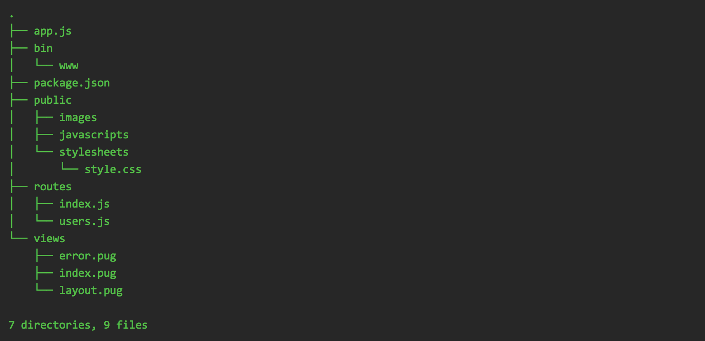
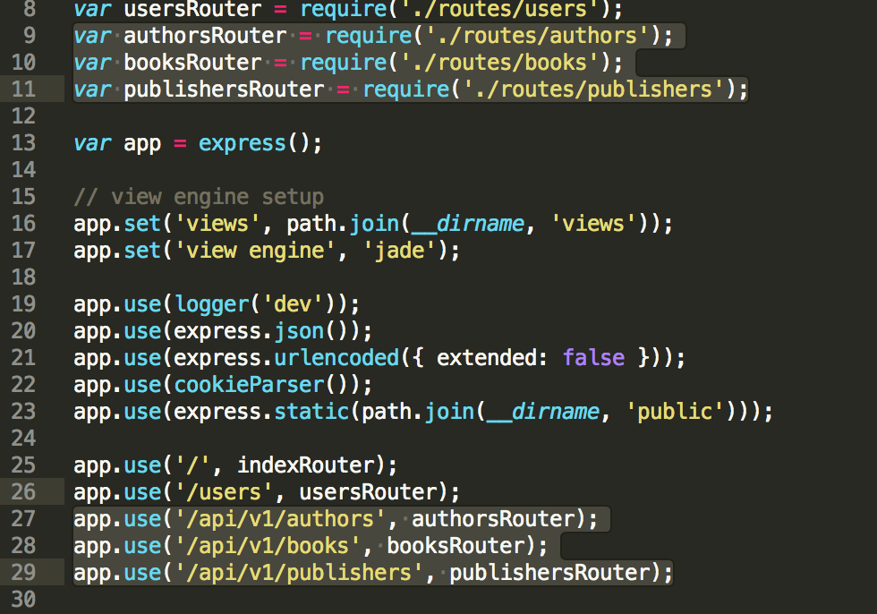

# Building the Backend

## Initializing your API Server

We will be using **express.js** to power the backend of our webapp. One of the key problems with express is that there are many ways to organize your code. To address that, the express.js team introduced the **express-generator** tool. The express-generator tool automatically builds your project scaffolding and organizes your code:

* Install **express-generator**

```bash
npm install express-generator
```

* Initialize Project

```bash
express amazon-backend
cd amazon-backend
npm install
npm start
```

It will create a boilerplate code with default routes for / and /users. It will also create a organized directory structure for your project:



The folders are self-explanatory:

* **public** - contains all static assets such as images, *.js files and stylesheets that express.js will be hosting.
* **routes** - contains the business logic, it contains the functions that will handle the incoming requests.
* **views** - contains the templates that can be used for rendering html. Express.js by default uses **[jade](http://jade-lang.com)** templating engine. There's also other templating engines that you can use such as **[ejs](http://ejs.co)**

If everything is in order, you should be able to open your web app on http://127.0.0.1:3000. Let's explore the code further during the hands on.

## Creating a Configuration File

If you have read the guide about [Organizing your code](https://github.com/adelagon/javascript-nodejs-gitbook/blob/master/intronode/organizing.md), it is important to externalize your configuration away from your code as much as you can. In our case, let's externalize the **port** and the **database** details.

Create a new file called **config.json** within the **amazon-backend** folder, with this following contents:

```json
{
    "app": {
        "port": "5000"
    },

    "db": {
        "dialect": "sqlite",
        "storage": "database.sqlite"
    }
}
```

Now let's hack the **bin/www** file to read the configuration file and use the provided **port ** configuration during the hands-on.

## Creating our Database Models

Given the Database Schema, we can use **sequelize** to create the models that we will use later on our API server. Sequelize will also create the database objects for us automatically.

- Install sqlite3 on your laptop:

  Ubuntu:

  ```bash
  sudo apt-get install sqlite3 # for debian-based systems
  sudo yum install sqlite      # for redhat-based systems
  ```

  Verify if sqlite3 is working:

  ```bash
  sqlite3
  SQLite version 3.16.0 2016-11-04 19:09:39
  Enter ".help" for usage hints.
  Connected to a transient in-memory database.
  Use ".open FILENAME" to reopen on a persistent database.
  ```

- Create a new **models folder** inside **amazon-backend** folder

- ```bash
  mkdir models
  cd models
  npm init
  ```

- Install sequelize

  ```bash
  npm install --save sequelize
  ```

- Install sqlite3 driver

  ```bash
  npm install --save sqlite3
  ```

- Creating models. Let's create three files under models folder named Authors, Publishers, and Books. For the sake of time, you can copy from **src/amazon-backend/routes** folder.

```javascript
// Books.js

module.exports = function(sequelize, DataTypes) {
  return sequelize.define('books', {
    bookId: {
      type: DataTypes.INTEGER(11),
      allowNull: false,
      primaryKey: true,
      autoIncrement: true
    },
    title: {
      type: DataTypes.STRING(2056),
      allowNull: false
    },
    copyright: {
      type: DataTypes.INTEGER(11),
      allowNull: false
    },
    authorId: {
      type: DataTypes.INTEGER(11),
      allowNull: false,
      references: {
        model: 'authors',
        key: 'authorId'
      }
    },
    publisherId: {
      type: DataTypes.INTEGER(11),
      alloNull: false,
      references: {
        model: 'publishers',
        key: 'publisherId'
      }
    },
  }, {
    tableName: 'books',
  });
};
```

- Let's create a file named **index.js** inside the models folder. It's job is to initialize the database connection and the models:

```javascript
let Sequelize = require('sequelize');
let config = require('../config.json');

// Initialize the database connection
var sequelize = new Sequelize(config.db);

// Import the models that we have previously created into sequelize
let Authors = sequelize.import('./authors');
let Books = sequelize.import('./books');
let Publishers = sequelize.import('./publishers');

var db = {
    "Authors": Authors,
    "Books": Books,
    "Publishers": Publishers,
    "sequelize": sequelize
};

module.exports = db;
```

* Now let's populate our database with some content to start with. I've created a helper script that you can download [HERE](https://gist.github.com/adelagon/2bc09c701f6864730d6fb55fcca59031). Save as **dump.js** inside the **models** and then run:

```bash
node models/dump.js
```

You should be able to see a new file that was generated **database.sqlite**. You can try exploring its contents by:

```bash
sqlite3 database.sqlite
SQLite version 3.16.0 2016-11-04 19:09:39
Enter ".help" for usage hints.
sqlite> .tables
authors     books       publishers
sqlite> select * from authors;
1|Charles|Dickens|2018-10-11 01:14:04.336 +00:00|2018-10-11 01:14:04.336 +00:00
2|F. Scott|Fitzgerald|2018-10-11 01:14:04.360 +00:00|2018-10-11 01:14:04.360 +00:00
3|Mark|Twain|2018-10-11 01:14:04.364 +00:00|2018-10-11 01:14:04.364 +00:00
4|Jane|Austen|2018-10-11 01:14:04.368 +00:00|2018-10-11 01:14:04.368 +00:00
5|H.G.|Wells|2018-10-11 01:14:04.371 +00:00|2018-10-11 01:14:04.371 +00:00
sqlite> .schema authors
CREATE TABLE `authors` (`authorId` INTEGER PRIMARY KEY AUTOINCREMENT, `firstName` VARCHAR(64) NOT NULL, `lastName` VARCHAR(64) NOT NULL, `createdAt` DATETIME NOT NULL, `updatedAt` DATETIME NOT NULL);
```

## Tying it all Together

The following guides will run you through on how to tie express and sequelize together in order to create a RESTFul API.  

* First, we need to implement the new Routers in on express.js. We need to edit the **app.js** and add the following lines that is highlighted here:

  

* Next will be adding the new files under the **routes** folder named **authors.js**, **publishers.js**, and **books.js**. For the sake of time, you can copy from **src/amazon-backend/routes** folder. Let's run through the code during the hands on.

```javascript
var models = require('../models');
var express = require('express');
var router = express.Router();

// Enable CORS 
var cors = require('cors');
router.all("*", cors());

// READ

router.get("/", async function(req, res, next) {
    try {
        let Books = await models.Books.findAll();
        res.json(Books);
    } catch (e) {
        next(e);
    }
});

router.get("/:bookId", async function(req, res, next) {
    try {
        let book = await models.Books.findOne({"where": { "bookId": req.params.bookId }});
        if (!book) {
            return res.status(404).send("Not Found");
        }
        res.json(book);
    } catch (e) {
        next(e);
    }
});

// CREATE
router.post("/", async function(req, res, next) {
    try {
        let author = await models.Authors.findOne({"where": { "authorId": req.body.authorId }});
        if (!author) {
            return res.status(404).send("Provided authorId Not Found");
        }
        let publisher = await models.Publishers.findOne({"where": { "publisherId": req.body.publisherId }})
        if (!publisher) {
            return res.status(404).send("Provided publisherId Not Found");
        }
        let book = models.Books.build({
            "title": req.body.title,
            "authorId": req.body.authorId,
            "publisherId": req.body.publisherId,
            "copyright": req.body.copyright
        });
        await book.save();
        res.json(book);
    } catch (e) {
        next(e);
    }
});

// UPDATE
router.put("/:bookId", async function(req, res, next) {
    console.log(req.body);
    try {
        let author = await models.Authors.findOne({"where": { "authorId": req.body.authorId }});
        if (!author) {
            return res.status(404).send("Provided authorId Not Found");
        }
        let publisher = await models.Publishers.findOne({"where": { "publisherId": req.body.publisherId }})
        if (!publisher) {
            return res.status(404).send("Provided publisherId Not Found");
        }
        let book = await models.Books.findOne({"where": { "bookId": req.params.bookId }});
        if (!book) {
            return res.status(404).send("Not Found");
        }
        book.title = req.body.title;
        book.authorId = req.body.authorId;
        book.publisherId = req.body.publisherId;
        book.copyright = req.body.copyright;
        await book.save();
        res.json(book);
    } catch (e) {
        next (e);
    }
});

// DELETE
router.delete("/:bookId", async function(req, res, next) {
    try {
        var book = await models.Books.findOne({"where": { "bookId": req.params.bookId }});
        if (!book) {
            return res.status(404).send("Not Found");
        }
        await book.destroy();
        res.json("success");
    } catch (e) {
        next (e);
    }
});

module.exports = router;
```


* If everything is in order you should be able the list of authors on http://localhost:5000/api/v1/authors/ and details of a single author in http://localhost:5000/api/v1/authors/1

