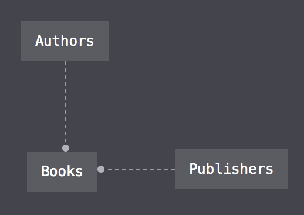
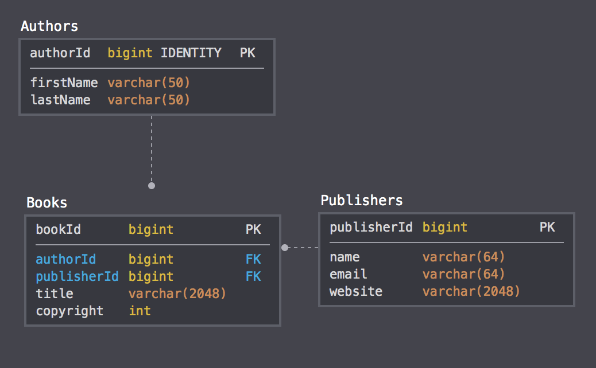

# Desigining the Database Schema

## Amazon 1.0 Data Model

Our simple website will have three models:

* **Authors** - will contain details about the authors
* **Publishers** - will contain details about the publishers
* **Books** - will contain details about the book, it also relates to Authors and Publishers.

### 

These three models will be exposed by an API endpoint that shoud allow the following operations:

* **CREATE** - add new objects to be implemented on **HTTP POST** methods
* **READ** - get objects to be implemented on **HTTP GET** methods
* **UPDATE** - update/replace objects to be implemented on **HTTP PUT** methods
* **DELETE** - delete objects to be implemented on **HTTP DELETE** methods

