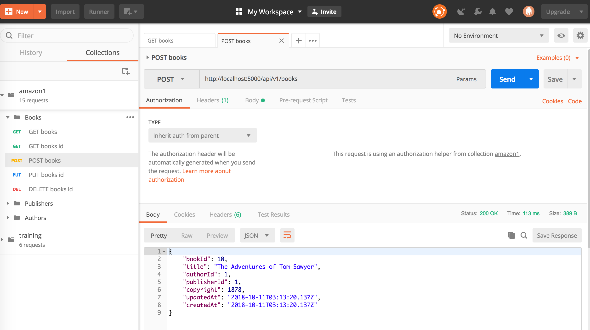

# Testing your API Server

Some HTTP verbs such as POST, PUT, and DELETE is a bit hard to simulate on a browser. For this, you can test your API Server using a very helpful tool called **Postman**. We will run through on how to use Postman during the hands-on.

You may also import the postman collections included in **src/amazon1/tests** folder.

If everything's running fine as expected then congratulations your API server is complete! :)

