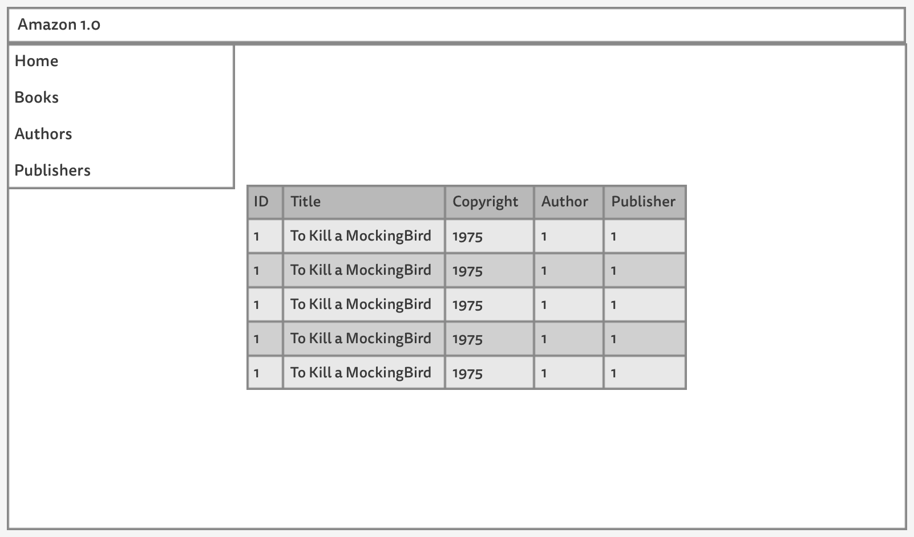
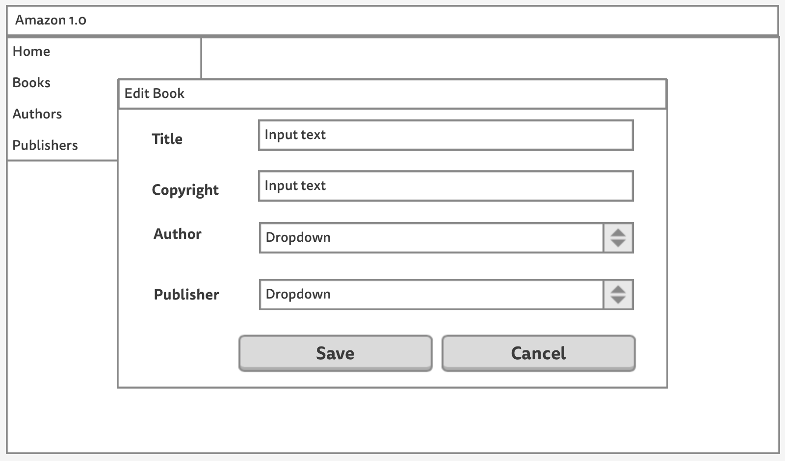

# Designing our UI

In real-world. Customer facing projects starts with UX engineers designing wireframes. This provides both the business people and engineers an idea on how to execute the project.

Our UI will be a modern-single page design. The UI should be snappy as possible. Reloading pages is a no-no as a lot of people will use it. It will utilize standard UI components such as:

* An Appbar
* A Sliding Menu
* Dialog Boxes for Inputs and Alerts
* Standard Buttons, InputFields, and SelectFields

Another design principle that we want to implement is **Material UI**. Since most of the users are quite familiar with mobile apps and popular sites such as google. Implementing the UI following this principle will greatly improve its usability and accessibility.

