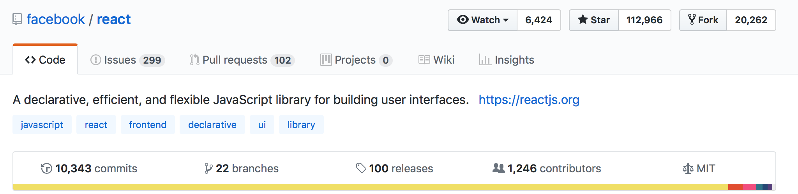
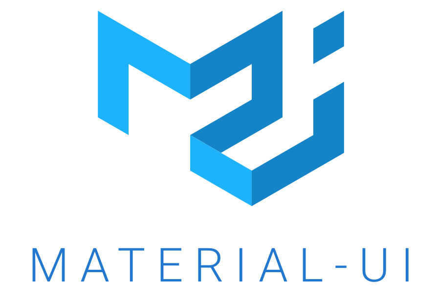

# Choosing our Tech Stack

Both Good and Bad, node.js has a huge library the you can use for web development. It is good having so many options to choose from but bad at the same time as most of the node.js beginners often find themselves on an analysis-paralysis when choosing one.

Coming from experience, I would recommend that you choose your tech stack in this form if you're building a new project.

* Always choose the simplest framework first then move on to more feature-rich ones as your projects become more complex.

* Make sure that the libraries you are using have a good community backing. One good indicator is its github stats such as # commits, # contributors, # stars, and activity:

  

## Express

For this tutorial, we will be using one of the most mature and most active web framework in node.js [**Express.js**](https://expressjs.com).

Express has been around for quite a while that even higher-level web frameworks were built on top of it such as **[Sails.js](https://sailsjs.com)** and **[Loopback](https://loopback.io)**

## Sequelize and SQLite3

Further simplify our Database access, we will be building our project will cover the **[Sequelize](https://sequelize.readthedocs.io/en/v3/)** ORM. Using an ORM has the following advantages:

* It automatically generates SQL queries for you
* Communicate with your database as if you are just interacting with objects (Model)
* Automatically synchronizes schema changes to your database
* Handles the database connection

ORM speeds up prototyping but for complex queries, it may produce inefficient database queries. So use with caution and fallback to writing RAW SQL queries if needed.

For simplicity for this training, we will be using a **[SQLite3](https://www.sqlite.org)** as our database. 

## React

[**React**](https://reactjs.org) is a modern user interface framework that was built by **Facebook**. Building frontend using React completely frees up your Web Application Server from generating HTML and moves the rendenring on the client-side (browser).

Building user interfaces in React also enables you to port your code to native mobile apps on Android and iOS through **[react-native](https://facebook.github.io/react-native/)**. 

## Material-UI

**[Material-UI](https://material-ui.com)** is one of the most popular HTML/CSS frameworks that has tight integration with React. Material-UI will help you create professional looking website following the **[Google's Material Design Principle](https://en.wikipedia.org/wiki/Material_Design)**

